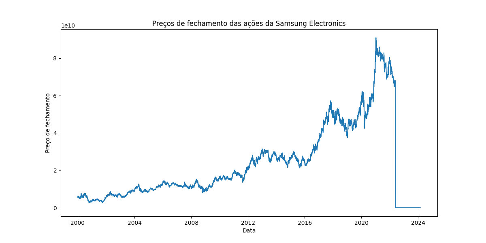
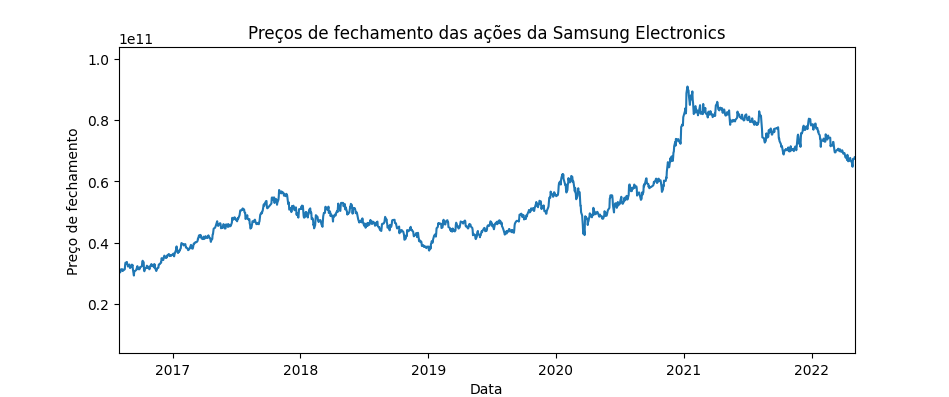
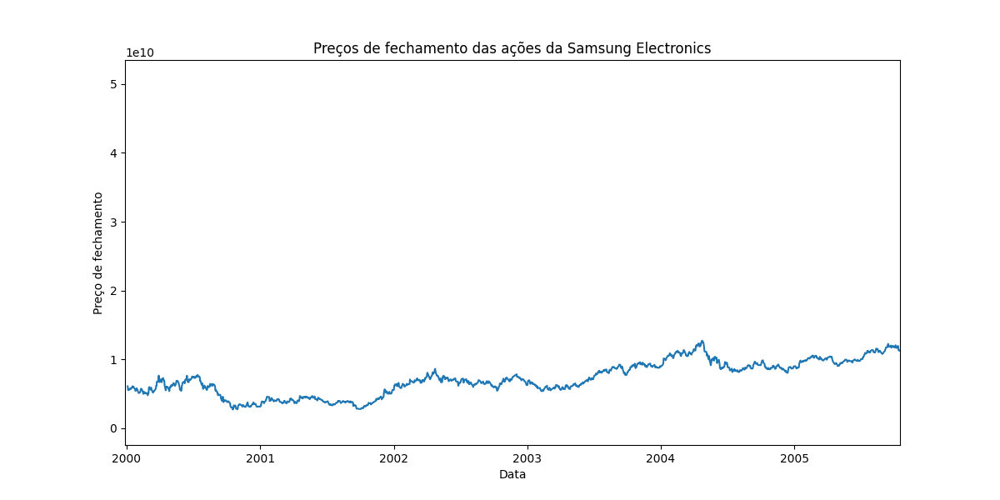

SAMSUNG ELECTRONICS 2000 - 2024 

> Visualização TOTAL DE 2000 Á 2024:

 MELHOR PREÇO DE FECHAMENTO ACONTECEU EM MAIO DE 2021 ATINGINDO 9.0 DO PREGÃO

> Analisando tendências históricas nos preços das ações da Samsung Electronics.

> GRÁFICO DE VISUALIZAÇÃO DA MAXIMA E MINIMAS DE AÇÕES.

> O MAIOR , MENOR E MÉDIO preço atingido pela ação durante o pregão.

> Explorando correlações entre o volume de negociação e as flutuações de preços.:

> Investigar o impacto de fatores externos ou eventos de mercado no desempenho das ações.
Em 2021, vários eventos impactaram o mercado e, consequentemente, as ações da Samsung Electronics. Alguns dos principais eventos incluem:
o lançamento  Galaxy S21, tablets, smartwatches e outros dispositivos eletrônicos
no primeiro trimestre , os resultados trimestrais de açoes da samsung foram anunciados.
Em maio de 2021 na alta de fechamento em ações , houve uma mudança de liderança , onde a samsung anunciou que Kim Ki-nam assumiria o cargo de CEO da divisão de eletrônicos de consumo, enquanto Koh Dong-jin se tornaria o CEO da 
divisão de TI e comunicações móveis. 
Logo apos isso veio a Pandemia - COVID afetando a economia global em 2021, com impactos significativos nos mercados financeiros.
 :

